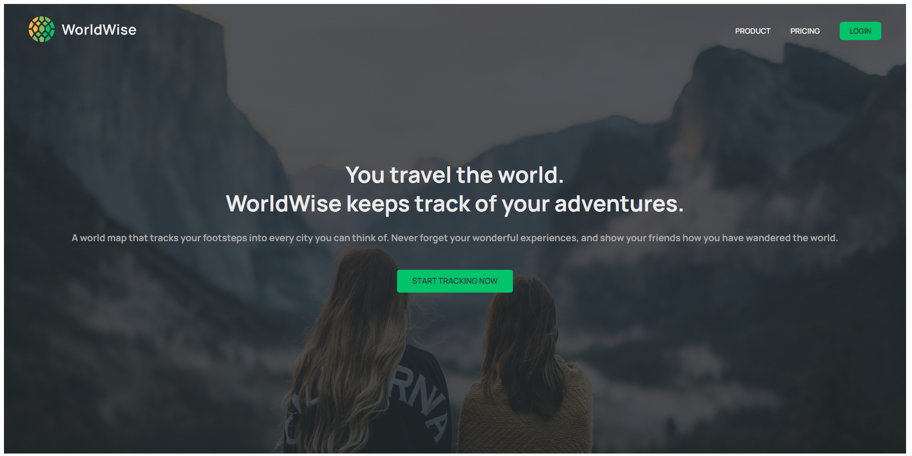
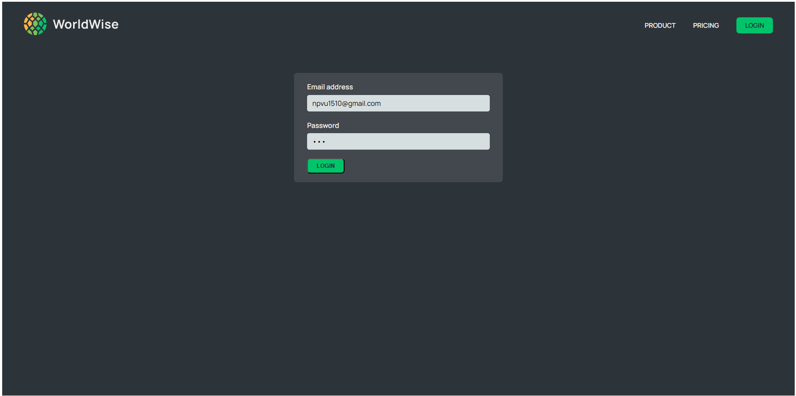
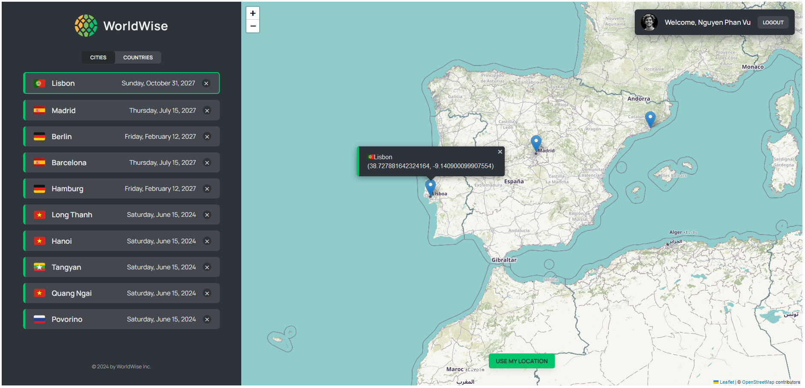
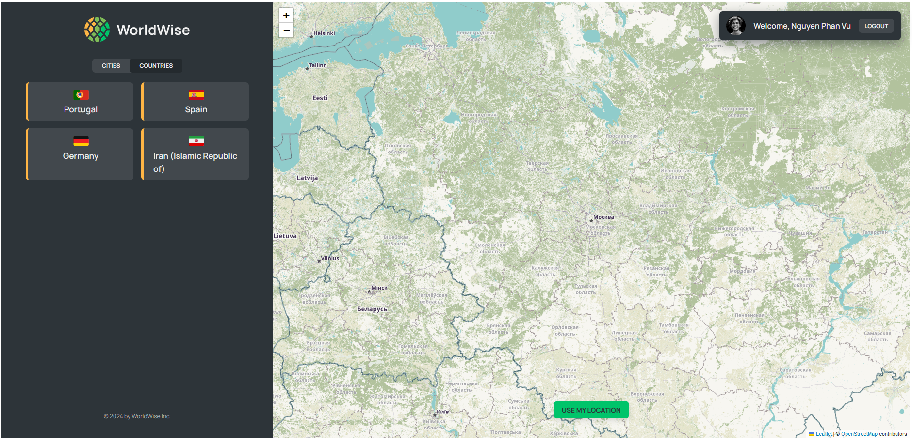
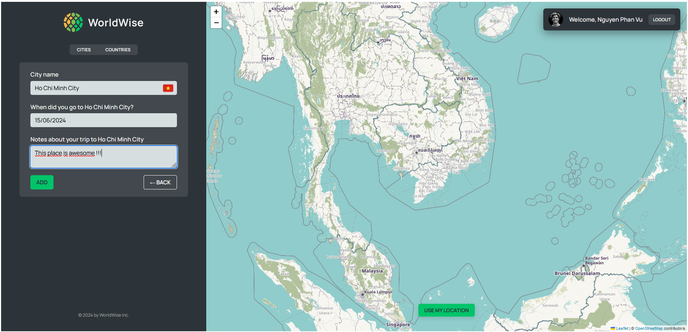

# World Wise Vite

A ReactJS application developed as part of the [Ultimate React Course on Udemy](https://www.udemy.com/course/the-ultimate-react-course). This project aims to practice ReactJS concepts and techniques such as global context and CSS modules.
It focuses on honing ReactJS skills without building a complete server, using `json-server` for simulating backend operations.

## Features

- Interactive map display
- Geolocation to get the user's current position (using Browser API)
- Allow users to mark locations on the map and save notes for planning or travel purposes
- Review and delete marked locations

## Technologies

- Vite
- CSS Modules
- Global Context
- Leaflet for maps
- json-server

## Screenshots
### Home Page


### Login Page


### Main Page




## Project Setup

1. Clone the repository:
   ```sh
   git clone https://github.com/npvu1510/world-wise.git

2. Install dependencies:
   ```sh
   npm install

3. Start the development server and JSON server:
   ```sh
   npm run dev
   npm run server

## Project Structure
```
world-wise-vite/
├── data/
├── public/
├── src/
|   ├── assets/
│   ├── pages/
│   ├── components/
│   ├── contexts/
│   ├── hooks/
│   ├── App.jsx
│   ├── index.css
│   ├── main.jsx
├── .eslintrc.json
├── .gitignore
├── index.html
├── package-lock.json
├── package.json
└── vite.config.js
```

## Routing Setup

```sh

function App() {
  return (
    <AuthProvider>
      <CitiesProvider>
        <BrowserRouter>
          <Routes>
            <Route index element={<Homepage />} />
            <Route
              path="app"
              element={
                <ProtectedRoute>
                  <AppLayout />
                </ProtectedRoute>
              }
            >
              <Route index element={<Navigate to="cities" />} />

              <Route path="cities" element={<CityList />} />

              <Route path="cities/:id" element={<City />} />

              <Route path="countries" element={<CountryList />} />

              <Route path="form" element={<Form />} />
            </Route>

            <Route path="product" element={<Product />} />

            <Route path="pricing" element={<Pricing />} />

            <Route path="login" element={<Login />} />

            <Route path="*" element={<PageNotFound />} />
          </Routes>
        </BrowserRouter>
      </CitiesProvider>
    </AuthProvider>
  );
}
```

## Global Context
### CitiesContext
```sh
const CitiesContext = createContext();

function CitiesProvider({ children }) {
  const [cities, setCities] = useState([]);
  const [currentCity, setCurrentCity] = useState({});
  const [isLoading, setIsLoading] = useState(false);
  const [error, setError] = useState('');

  // console.log('render CitiesProvider');
  // console.log(currentCity, cities, isLoading);
  // console.log(`isLoading: ${isLoading}`);

  useEffect(function () {
    const fetchCities = async function () {
      try {
        setError('');
        setIsLoading(true);

        const res = await fetch('http://localhost:8000/cities');

        if (res.status !== 200)
          throw new Error('Something went wrong when fetching');

        const data = await res.json();
        setCities(data);
      } catch (err) {
        // console.log(`⚠️⚠️⚠️`, err.message);
        setError(err.message);
      } finally {
        setIsLoading(false);
      }
    };

    fetchCities();
  }, []);

  const fetchCity = async function (id) {
    try {
      setError('');
      setIsLoading(true);

      const res = await fetch(`http://localhost:8000/cities/${id}`);

      if (res.status !== 200)
        throw new Error('Something went wrong when fetching');

      const data = await res.json();
      setCurrentCity(data);
    } catch (err) {
      // console.log(`⚠️⚠️⚠️`, err.message);
      setError(err.message);
    } finally {
      setIsLoading(false);
    }
  };

  const createCity = async function (newCity) {
    try {
      setError('');
      setIsLoading(true);

      const res = await fetch(`http://localhost:8000/cities`, {
        method: 'POST',
        body: JSON.stringify(newCity),
        headers: { 'content-type': 'application/json' },
      });

      if (!res.ok) throw new Error('Something went wrong when fetching');

      const data = await res.json();
      setCities((cities) => [...cities, data]);
    } catch (err) {
      console.log(`⚠️⚠️⚠️`, err.message);
      setError(err.message);
    } finally {
      setIsLoading(false);
    }
  };

  const deleteCity = async function (id) {
    try {
      setError('');
      setIsLoading(true);

      const res = await fetch(`http://localhost:8000/cities/${id}`, {
        method: 'DELETE',
        headers: { 'content-type': 'application/json' },
      });

      if (!res.ok) throw new Error('Something went wrong when fetching');

      const newCityList = [...cities].filter((city) => city.id !== id);
      setCities(newCityList);
    } catch (err) {
      console.log(`⚠️⚠️⚠️`, err.message);
      setError(err.message);
    } finally {
      setIsLoading(false);
    }
  };

  return (
    <CitiesContext.Provider
      value={{
        cities,
        currentCity,
        fetchCity,
        deleteCity,
        isLoading,
        error,
        createCity,
      }}
    >
      {children}
    </CitiesContext.Provider>
  );
}
```

## Contribution
Feel free to fork this project and submit pull requests. Any contributions are greatly appreciated.

## License
This project is licensed under the MIT License.
